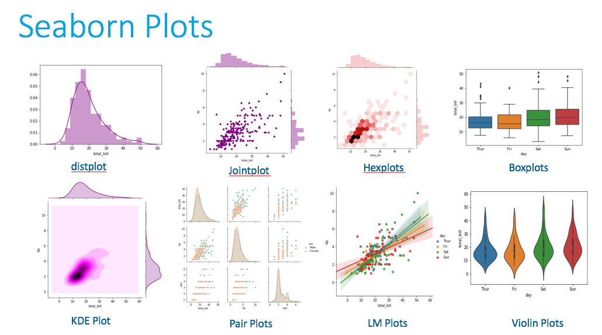
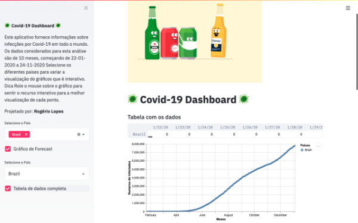

## Ejemplo de Porfolio 
# Bienvenido a mi portfolio
### Aquí podrás encontrar los proycectos en los que he estado trabajo

## [Taller de Seaborn](https://github.com/Cristina-TheBridge/Seaborn)
Taller introductoria para la clase de Data Science para el uso de la libería de Python Seaborn.    
  

## [Taller de Streamlit](https://github.com/Cristina-TheBridge/Taller-Streamlit)
Taller introductorio para la clase de Data Science para el uso de Steamlit.    

